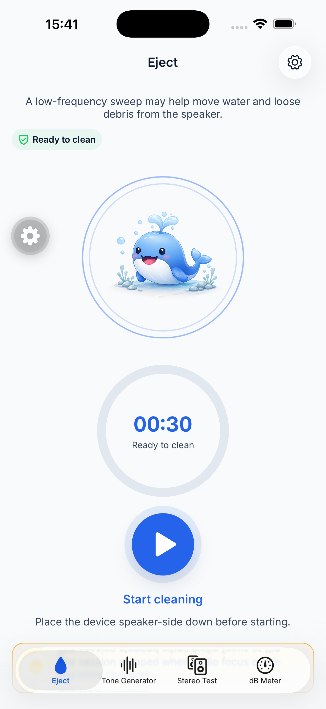
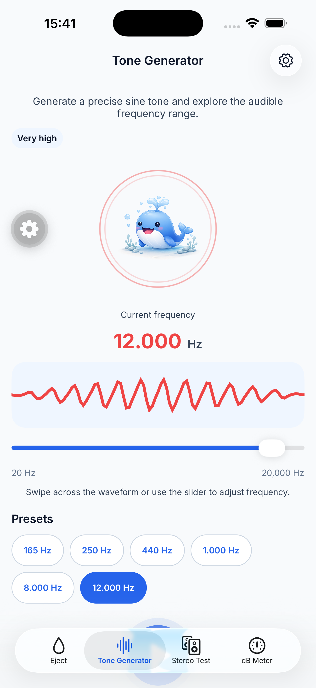
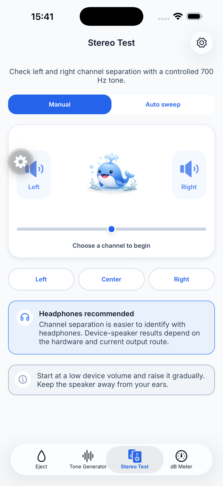
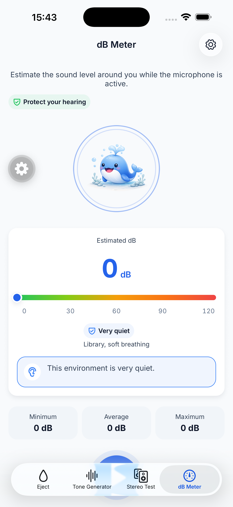
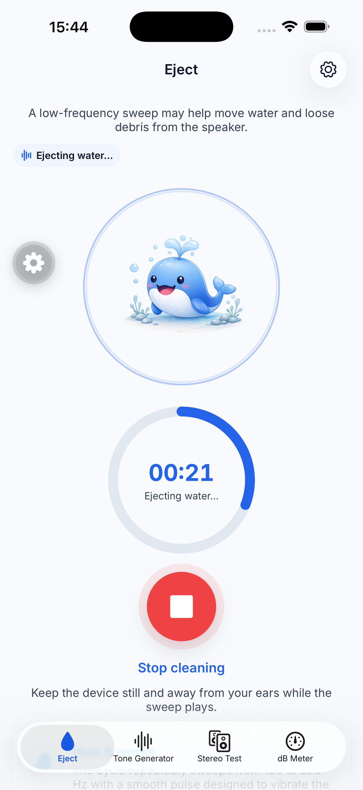
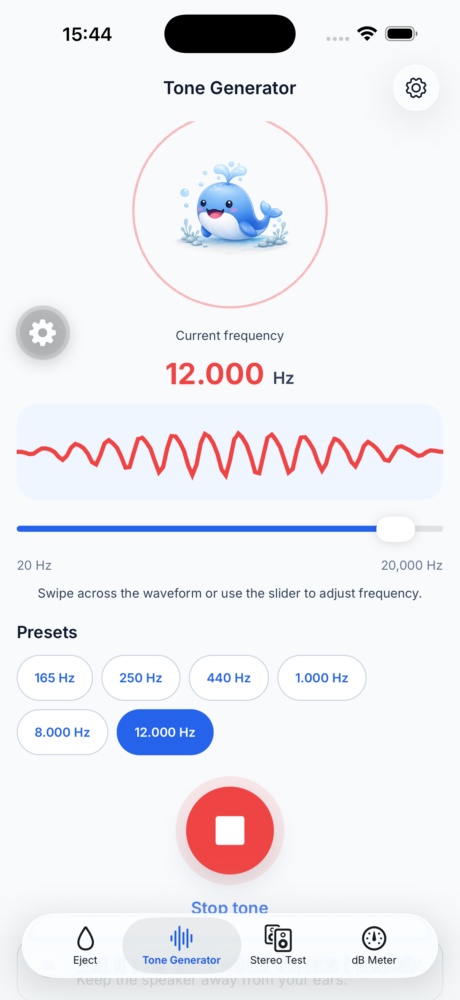
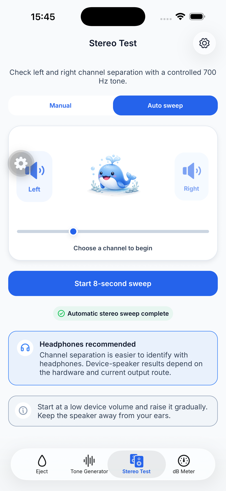
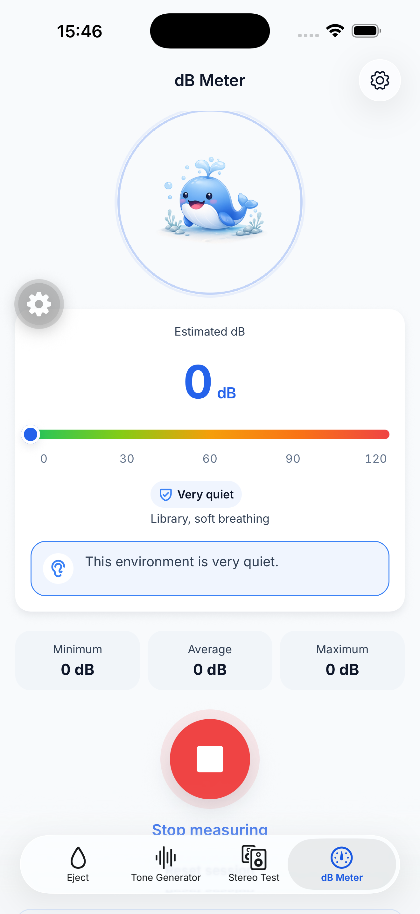

# Audio tools UI audit

Date: 2026-07-21

## Audit scope

- Surface: the four audio-tool tabs in the `feat/water-eject` iOS build.
- Device: iPhone 17 Pro Max simulator, iOS 26.5, portrait.
- User goal: understand the current state and reach the primary audio action quickly.
- Accessibility target: primary state and action remain visually reachable while labels, state changes, and controls remain understandable without color or motion.

## Overall verdict

The product functionality is present and the visual language is consistent, but Eject, Tone Generator, and dB Meter are composed as long content pages rather than focused tools. The shared vertical stack gives the subtitle, status, mascot, instrument, presets/stats, action, and explanatory notices similar weight. On the largest test phone, Tone and dB Meter obscure their primary action behind the tab bar, and Eject requires scrolling to reach secondary content. Stereo Test is the strongest pattern because its stage and controls are grouped into one task area.

## Captured flow

### 1. Eject — idle

Health: Needs improvement

- Strength: the title, safe state, mascot, duration, and start control are understandable at a glance.
- Risk: `Ready to clean` appears in the badge and progress ring, while the nearby action repeats the state again. The screen uses a full mascot hero and a full progress ring before the action, so supporting content starts behind the tab bar.
- Recommendation: use one hero instrument. Keep the mascot plus start action while idle, then replace that area with the timer ring while active. Move “How it works” to an info sheet.

### 2. Tone Generator — idle

Health: Poor

- Strength: frequency, range, waveform, and presets are understandable, and the waveform exposes an adjustable accessibility value.
- Risk: the primary Play action is obscured by the tab bar. Six always-visible preset chips consume the space needed by the main action. A user can adjust the tone before they can clearly discover how to play it.
- Recommendation: keep frequency, waveform, slider, and Play in one control surface. Replace the preset grid with one Presets action that opens a sheet, or a single compact horizontal row.

### 3. Stereo Test — manual idle

Health: Good with minor density issues

- Strength: mode, stage, and channel controls form a coherent task. All primary controls are visible without scrolling on the test device.
- Risk: two persistent guidance notices use substantial space and compete with the task. The development-only floating gear also obstructs the left speaker in QA captures.
- Recommendation: retain this screen as the structural reference. Show the headphone recommendation once or behind an info action, and keep only safety guidance that is essential during playback.

### 4. dB Meter — idle from the true top

Health: Poor

- Strength: the meter reading, range, named band, and explanatory copy are clear and do not rely only on color.
- Risk: the mascot and oversized meter card consume the whole first viewport. The primary Start action is below the fold and partially obscured by the tab bar even on an iPhone 17 Pro Max.
- Recommendation: remove or sharply reduce the mascot. Combine the reading, gauge, status, min/average/max, and Start/Stop control into one compact instrument panel. Move privacy detail to an info sheet while retaining a short disclosure near first use.

### 5. Eject — running

Health: Needs improvement

- Strength: timer progress and Stop are visible, state changes do not rely on color, and the active state is easy to recognize.
- Risk: `Ejecting water…` is repeated in the badge and timer ring, while the mascot remains the largest object. The screen scrolls even though the active task needs only progress, Stop, and one safety sentence.
- Recommendation: let the timer ring become the active hero and reduce or remove the mascot during playback.

### 6. Tone Generator — running

Health: Poor

- Strength: frequency feedback remains prominent while audio is active.
- Risk: after the off-screen Play action is activated, the page shifts but the Stop label remains covered by the tab bar. This creates a safety and discoverability problem for the most important active-state action.
- Recommendation: place Play/Stop in a persistent control row directly below the slider or pin it above the tab bar. It must never share the tab bar’s visual space.

### 7. Stereo Test — automatic sweep complete

Health: Good

- Strength: Start, completion feedback, stage, and navigation all remain visible. The selected mode is clear.
- Risk: the stage still says `Choose a channel to begin` in Auto mode, which conflicts with the completed automatic flow. Persistent notices still dominate the lower half.
- Recommendation: make stage guidance mode-specific and condense secondary guidance.

### 8. dB Meter — running

Health: Poor

- Strength: current status and statistics remain legible, and Stop has an explicit accessibility label.
- Risk: the visible Stop label and part of the control are covered by the tab bar. For a live microphone tool, the stop action must remain persistently visible and unobstructed.
- Recommendation: integrate Start/Stop into the meter panel or pin it immediately above navigation. Do not place explanatory content before this control.

## Highest-impact changes

1. Introduce a focused tool-screen layout whose primary state and action fit in one normal-phone viewport; retain scrolling only as a fallback for small screens, localization, and large text.
2. Reserve the first viewport for one instrument/hero, one primary action, and at most one short supporting message.
3. Move educational, privacy, safety, and preset detail into sheets or secondary routes.
4. Eliminate repeated state copy and show only guidance relevant to the current state.
5. Keep Start/Stop above the tab bar in every state and validate this with screenshots before handoff.
6. Hide development overlays during visual QA so they do not obstruct controls or distort review results.

## Accessibility evidence and limits

The captured iOS accessibility tree exposes descriptive Start/Stop labels, selected segmented-control states, text equivalents for status, and adjustable values for the Tone waveform and dB gauge. Screenshots also show large touch targets and non-color status labels.

This audit does not prove contrast ratios, VoiceOver reading order, focus recovery, Dynamic Type reflow, reduced-motion behavior, or Android behavior. Error states were not deliberately induced. Those require targeted runtime checks after a visual direction is selected.
