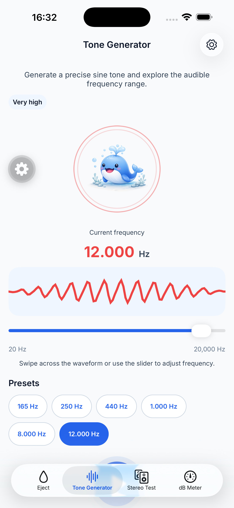
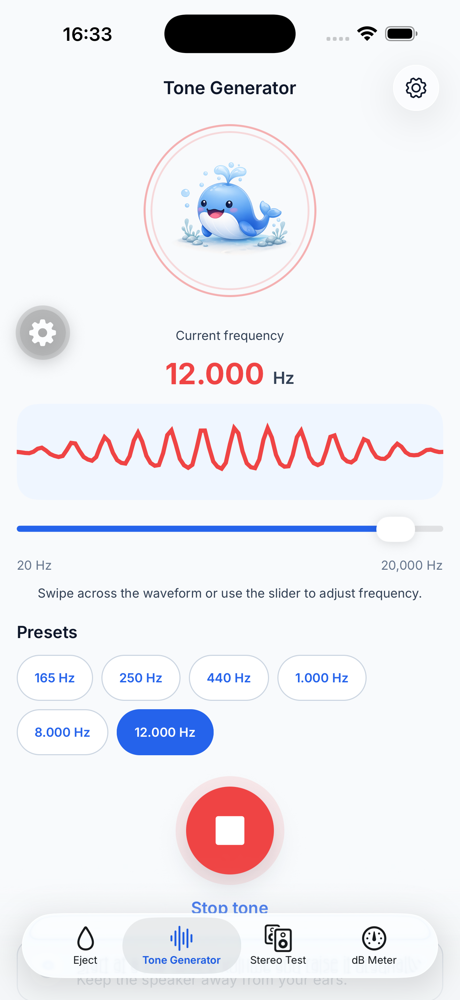

# Tone Generator focused audit

Date: 2026-07-21

## Audit scope

- Surface: Tone Generator tab in the current iOS simulator build.
- Device: iPhone 17 Pro Max simulator, iOS 26.5, portrait, 1320 × 2868 capture.
- Flow: inspect the idle state, start the tone, inspect the running state, and stop the tone.
- User goal: choose a frequency, understand its band, start playback, adjust it live, and stop it immediately.
- Accessibility target: keep the adjustable frequency control and Play/Stop action reachable, labeled, and understandable without relying on color or motion.

## Overall verdict

The frequency instrument is understandable and already exposes useful accessible values, but the screen is composed as a long content page. The mascot and six wrapping presets push the primary Play/Stop control into the native tab bar in both idle and running states. This is a critical interaction and safety issue because the control that starts audio is hard to discover and the control that stops audio is partially obscured.

## Captured flow

### 1. Idle — choose a frequency

Health: Poor

- Strengths: the frequency value, band label, waveform, logarithmic range, selected preset, and adjustment hint form a coherent instrument. The waveform exposes increment and decrement accessibility actions, and the native slider has a numeric value.
- UX risks: the subtitle, mascot, waveform, slider, hint, two-row preset grid, and action all compete for the same vertical space. Play is covered by the tab bar before playback begins, so the screen explains adjustment before making its main outcome discoverable.
- Accessibility risks: the Play button exists in the accessibility tree but its visual control is obstructed. A sighted user with motor or cognitive accessibility needs may struggle to identify or target it reliably.
- Recommendation: reserve the first viewport for frequency, waveform/slider, compact presets, and one large Play/Stop control. Remove the mascot from this utility screen and condense the adjustment hint.

### 2. Running — adjust or stop the tone

Health: Poor

- Strengths: the active waveform keeps the current frequency prominent, the button changes from Play to Stop in both the visual and accessibility state, and frequency remains adjustable during playback.
- UX risks: the Stop label is directly behind the tab bar and the safety notice is almost entirely hidden. The active state provides no compact persistent status near the control, while the mascot remains the largest object on the screen.
- Accessibility risks: the most time-sensitive control is visually obstructed. Screenshots cannot confirm VoiceOver focus recovery after Play becomes Stop, so that still requires runtime verification.
- Recommendation: keep Stop in the same stable, unobstructed location as Play, directly beneath the instrument. Show a short playback state cue without relying only on the red button or animated waveform.

## Highest-impact changes

1. Use the focused screen shell so the main task clears the native tab bar without mandatory scrolling.
2. Make the frequency instrument the hero; remove the decorative mascot from this tab.
3. Keep Play/Stop in a stable position directly below the slider or inside the instrument surface.
4. Compress presets into one horizontal row or a secondary sheet so they do not displace the main action.
5. Keep the gradual-volume warning visible but concise, and validate VoiceOver focus, Dynamic Type reflow, reduced motion, and Android separately.

## Evidence limits

The audit confirms visible layout, current accessibility labels and adjustable actions, and the Play-to-Stop state change on the iOS simulator. It does not prove contrast ratios, VoiceOver reading order or focus recovery, Dynamic Type behavior, reduced-motion behavior, error recovery, or Android layout.
